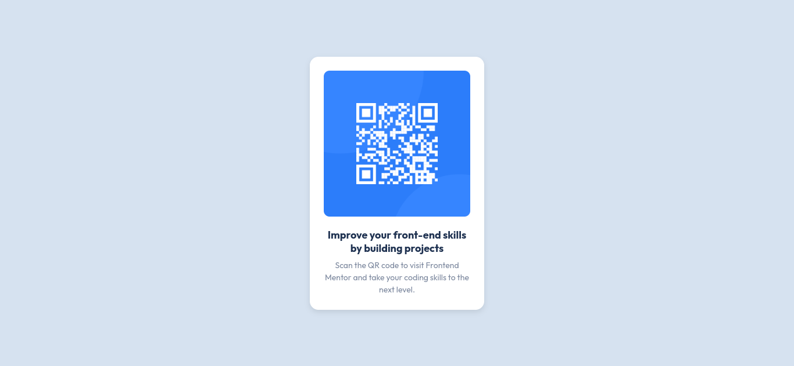

# Frontend Mentor - QR code component solution

This is a solution to the [QR code component challenge on Frontend Mentor](https://www.frontendmentor.io/challenges/qr-code-component-iux_sIO_H). Frontend Mentor challenges help you improve your coding skills by building realistic projects.

## Table of contents

- [Overview](#overview)
  - [Screenshot](#screenshot)
  - [Links](#links)
- [My process](#my-process)
  - [Built with](#built-with)
  - [What I learned](#what-i-learned)
  - [Continued development](#continued-development)
  - [Useful resources](#useful-resources)
- [Author](#author)

## Overview

### Screenshot

### Links

- Solution URL: [https://sylva-egb.github.io/qr-code-component/](https://sylva-egb.github.io/qr-code-component/)

## My process

### Built with

- Semantic HTML5 markup
- CSS custom properties
- Flexbox
- Mobile-first workflow

### What I learned

By working on this first challenge, I have learnt how to center a div element, vertically and horizontally. For a backend developer this new lerning is so great

### Continued development

For the future projects, I want to deeply understand how to deal with the css properties that center a div

### Useful resources

- [How to do a card in css](https://www.w3schools.com/howto/howto_css_cards.asp) - This helped me for XYZ reason. I really liked this pattern and will use it going forward.

## Author

- Website - [GitHub](https://www.github.com/Sylva-Egb)
- Frontend Mentor - [@Sylva-Egb](https://www.frontendmentor.io/profile/Sylva-Egb)
- Twitter - [@call_him_Sylva](https://www.x.com/call_him/sylva)
